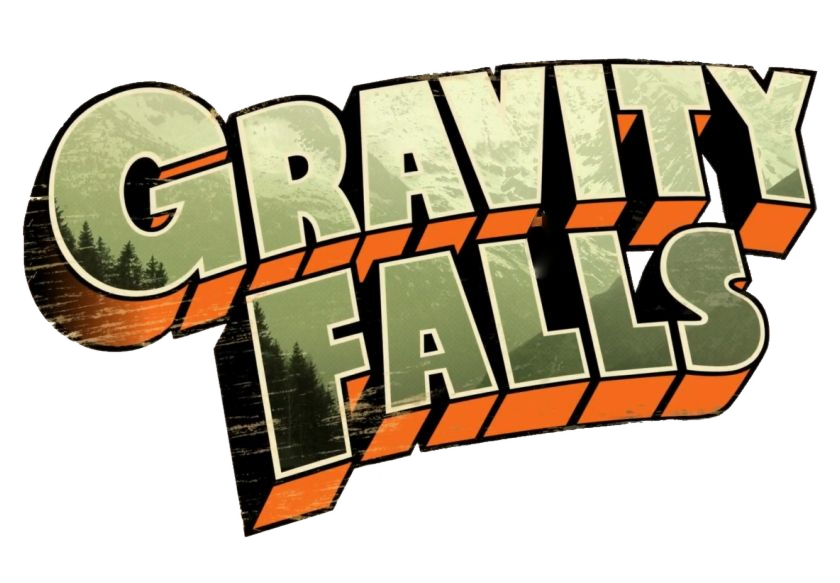

<h1 text-align="center">
    
</h1>

    <h2>Objetivos do Projeto</h2>
    
- Um projeto com fins educacionais na área de programação 📚👌

    
- Ampliar meus conhecimentos

    
- Feito na "Semana do Dev em Dobro"

    <h2>Tecnologias Usadas 💻</h2>
    <ul  style="display: inline_block">
        <li>HTML  </li>
        <li>CSS  </li>
        <li>JS  </li>
    </ul>

    <h2>Como clonar o projeto? 🤷‍♀️</h2>
    
1- Ter o Git

    
2- No Git

    git clone https://github.com/CleitonBread/Projeto-Gravity-Falls.git

    <h2>Quer me conhecer mais? 👍🎮</h2>
    
 
        
         
        
        
    

